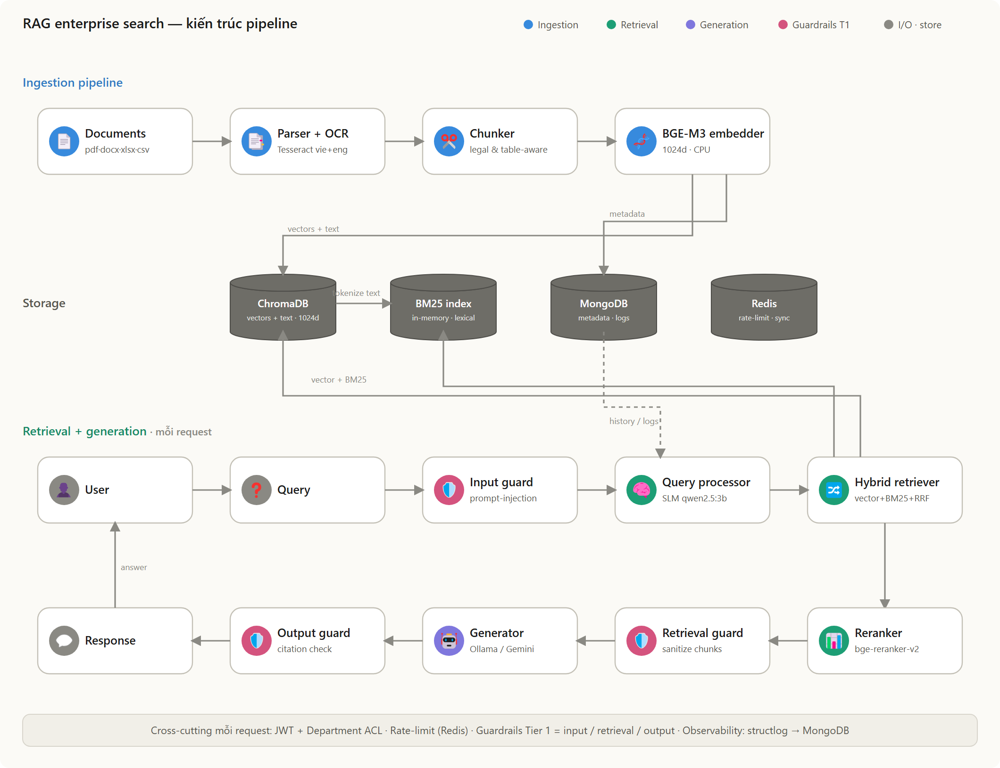
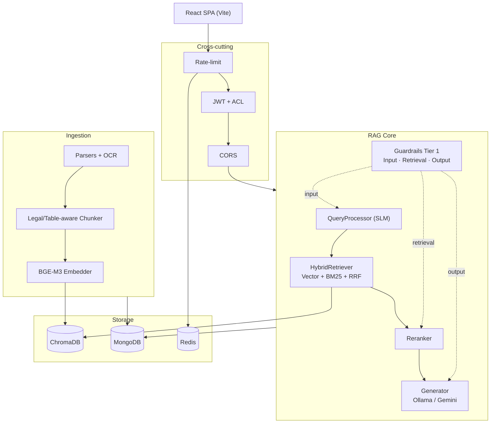

<div align="center">

# 🔎 RAG Enterprise Search

**Hệ thống tra cứu và hỏi đáp tài liệu nội bộ doanh nghiệp trên nền Retrieval-Augmented Generation**

Suy luận **100% local** · Hybrid Retrieval (Vector + BM25 + RRF) · Query Processing đa nhánh · Guardrails · Document-level ACL

<br/>


</div>

---

## 📖 Giới thiệu

Nền tảng **Retrieval-Augmented Generation (RAG)** phục vụ tra cứu và hỏi đáp trên kho tài liệu nội bộ của doanh nghiệp. Người dùng đặt câu hỏi bằng ngôn ngữ tự nhiên và nhận câu trả lời **có trích dẫn nguồn**, đúng quyền truy cập theo phòng ban.

Hệ thống được thiết kế cho **mọi loại tài liệu doanh nghiệp** (định dạng PDF, Word, Markdown, Excel, CSV). Dataset văn bản pháp lý tiếng Việt hiện dùng làm bộ dữ liệu kiểm thử chất lượng.
---

## ✨ Tính năng nổi bật

| | Tính năng | Mô tả |
|---|---|---|
| 🔀 | **Hybrid Retrieval** | Dense Vector (BGE-M3) + BM25 keyword, hợp nhất bằng **Reciprocal Rank Fusion (RRF)** — kết hợp tìm kiếm ngữ nghĩa và khớp chính xác từ khóa/mã số |
| 🧠 | **Query Processing đa nhánh** | SLM local phân loại → viết lại (rewrite) → phân rã multi-query cho câu hỏi phức tạp/multi-hop |
| 📑 | **Chunking nhận biết cấu trúc** | Tách chunk theo cấu trúc phân cấp của tài liệu; xử lý **bảng biểu atomic** (PDF/Excel/CSV) không làm loãng embedding |
| 🔐 | **Document-level ACL** | Phân quyền theo phòng ban, thực thi đồng nhất trên **cả 3 nguồn** (ChromaDB, BM25, MongoDB), derive server-side từ JWT chống spoof |
| 🛡️ | **Guardrails Tier 1** | Input/Retrieval/Output — chặn prompt-injection, jailbreak, redact nội dung độc, cross-check trích dẫn (thuần regex, fail-open) |
| 🎯 | **Reranking** | Cross-encoder `bge-reranker-v2-m3` tinh chỉnh top-k sau fusion |
| ⚙️ | **Multi-worker** | Đồng bộ BM25 in-memory giữa các worker qua Redis version-marker + build-on-startup; rate-limit per-user/IP; upload dedup (SHA-256) |
| 📊 | **Observability** | Request tracing (structlog) + dashboard React (latency breakdown, OCR fail rate) |

---

## 🏗️ Kiến trúc tổng quan

Kiến trúc **Layered / Clean Architecture** trên nền monolith Flask, gồm các tầng logic (Ingestion · Query Processing · Retrieval · Generation · Observability) và một tầng Production Hardening cross-cutting.



<details>
<summary>Sơ đồ khối rút gọn (mermaid)</summary>



</details>

## 🧰 Tech Stack

<table>
<tr><td valign="top" width="50%">

**AI / ML (local, CPU-only)**
- Embedding: **BGE-M3** (1024-dim, đa ngôn ngữ)
- Reranker: **bge-reranker-v2-m3** (CrossEncoder)
- LLM + SLM: **qwen2.5:3b-instruct** qua Ollama
- LLM fallback / judge: Google Gemini
- Keyword: rank-bm25 (BM25Okapi)
- OCR: Tesseract (`vie`) · Parse: PyMuPDF, python-docx, openpyxl

</td><td valign="top" width="50%">

**Backend · Storage · Infra**
- Python 3.13 · Flask 3.1 · Gunicorn
- Flask-JWT-Extended · Flask-Limiter · bcrypt
- Vector: **ChromaDB** · Docs: **MongoDB 7**
- Cache/coord: **Redis** · Logging: structlog
- **Frontend:** React 18 + Vite + TailwindCSS + Recharts
- **Infra:** Docker Compose · Nginx

</td></tr>
</table>

---

## 🚀 Cài đặt & Chạy

### Yêu cầu

- **Docker + Docker Compose** (cách nhanh nhất), hoặc Python 3.13 + Node 18+ cho dev thủ công
- **[Ollama](https://ollama.com)** đã cài model `qwen2.5:3b-instruct` (cho LLM local mặc định) — hoặc dùng Gemini bằng cách đặt `USE_LOCAL_LLM=false` + `GOOGLE_API_KEY`

### Cách 1 — Docker Compose

```bash
git clone <repo-url>
cd RAG

# Cấu hình biến môi trường
cp .env.example .env
#   → điền SECRET_KEY, JWT_SECRET_KEY (bắt buộc)
#   → (tùy chọn) GOOGLE_API_KEY nếu dùng Gemini

# Khởi động toàn bộ stack (backend · frontend · mongo · chromadb)
docker-compose up --build
```

### Cách 2 — Dev thủ công (single-machine)

```bash
# --- Backend ---
cd backend
pip install -r requirements.txt
python run.py                     # Flask dev server → http://localhost:5000

# --- Frontend (terminal khác) ---
cd frontend
npm install
npm run dev                       # Vite → http://localhost:5173
```

### Khởi tạo dữ liệu

```bash
cd backend
python scripts/create_admin.py    # tạo tài khoản admin đầu tiên
python scripts/bulk_ingest.py     # nạp hàng loạt tài liệu vào kho
```

---

## ⚙️ Cấu hình then chốt

Các biến quan trọng khi chuyển giữa dev và production (chi tiết đầy đủ ở [`SYSTEM_ARCHITECTURE.md`](SYSTEM_ARCHITECTURE.md) mục 7):

| Biến | Single-machine (dev) | Multi-worker (prod) | Ý nghĩa |
|---|---|---|---|
| `USE_LOCAL_LLM` | `true` | `true` | Dùng Ollama local; `false` → Gemini |
| `CHROMA_MODE` | `persistent` | `http` | Persistent không an toàn khi đa-worker |
| `BM25_SYNC_ENABLED` | `true` | `true` | Build-on-startup + đồng bộ (bắt buộc để hybrid đúng) |
| `REDIS_URL` | *(trống)* | `redis://…` | Rate-limit chung + marker BM25 |
| `TRUST_PROXY` | `false` | `true` | ProxyFix đọc `X-Forwarded-For` sau Nginx |

---

## 🔌 API chính

| Method | Endpoint | Auth | Rate-limit | Mô tả |
|---|---|---|---|---|
| `POST` | `/api/auth/login` | — | 5/phút (IP) | Đăng nhập → access/refresh token |
| `POST` | `/api/chat/message` | JWT | 20/phút (user) | Hỏi–đáp RAG (trả `answer` + `sources`) |
| `GET` | `/api/chat/sessions` | JWT | — | Lịch sử hội thoại |
| `POST` | `/api/documents/upload` | JWT | 10/phút (user) | Upload + dedup + ingest async |
| `GET` | `/api/documents/` | JWT | — | Danh sách tài liệu (đã lọc ACL) |
| `PATCH` | `/api/documents/<id>/metadata` | JWT (admin) | — | Gán status/type/department |
| `DELETE` | `/api/documents/<id>` | JWT (owner/admin) | — | Xóa tài liệu + chunk |
| `GET` | `/api/dashboard/*` | JWT (admin) | — | Observability metrics |
| `GET` | `/api/health` | — | — | Health check (cho monitoring) |

**Mã lỗi chuẩn:** `400` guardrail/validation · `403` ACL ghi · `404` ACL đọc · `409` dedup · `422` JWT sai · `429` rate-limit.

---

## 📁 Cấu trúc thư mục

```
RAG/
├── backend/
│   ├── app/
│   │   ├── __init__.py          # Composition root: create_app(), DI, fail-loud
│   │   ├── api/                 # Blueprints: auth, documents, chat, dashboard, health
│   │   ├── core/                # RAG pipeline, hybrid retriever, query processor,
│   │   │   │                    #   reranker, generator, guardrails, observability
│   │   │   └── guardrails/
│   │   ├── ingestion/           # Parsers, OCR, chunker, embedder
│   │   ├── vectorstore/         # VectorStoreOps (ChromaDB + ACL where-clause)
│   │   ├── services/            # document_service (vòng đời tài liệu)
│   │   └── models/
│   ├── scripts/                 # create_admin, bulk_ingest
│   ├── tests/                   # unit · e2e · benchmark
│   └── run.py
├── frontend/                    # React 18 + Vite (chat, admin, observability)
└── docker-compose.yml
```

---

## 🗺️ Trạng thái & Định hướng

Dự án được phát triển theo bản đồ kiến trúc đích 6 layer + 6 phase,

- ✅ Ingestion · Query Processing · Retrieval · Generation · Production Hardening (Auth, Guardrails, ACL, Rate-limit, Multi-worker sync, Dedup)
- 🔬 **Nghiên cứu quy mô lớn (PoC, chưa production):** unified engine OpenSearch + ingestion queue Celery/Redis cho giả định 100k+ tài liệu.


---

## 🤝 Đóng góp

1. Fork repository
2. Tạo feature branch (`git checkout -b feature/ten-tinh-nang`)
3. Commit thay đổi (`git commit -m 'Add: mô tả tính năng'`)
4. Push branch (`git push origin feature/ten-tinh-nang`)
5. Mở Pull Request

---

## 📄 License

[MIT License](LICENSE)
